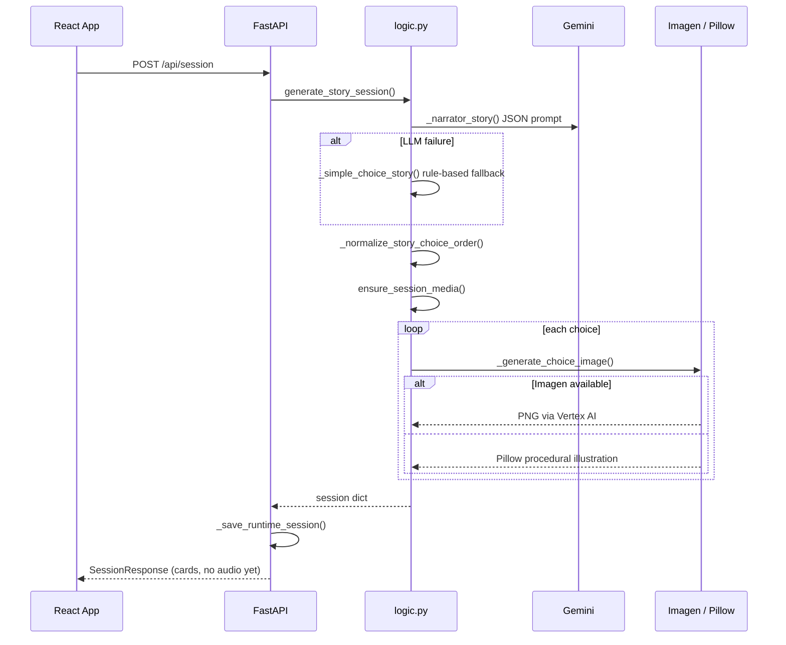
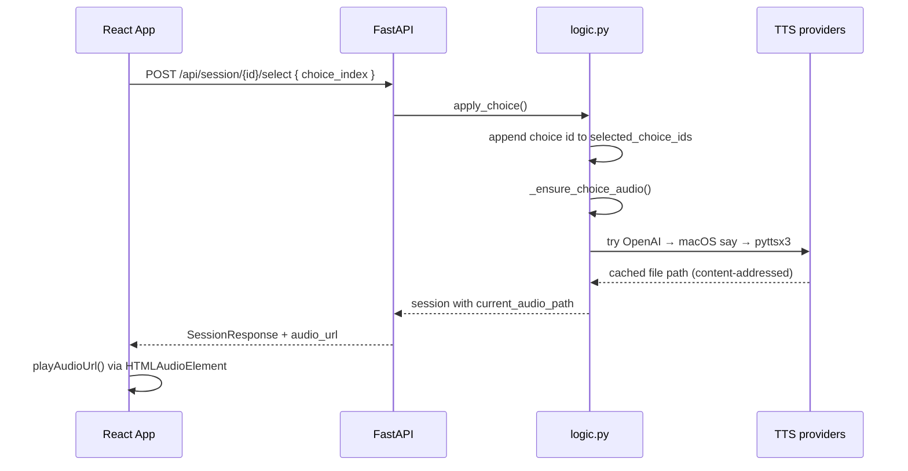

# Living Social Stories — Technical Design Document

**Version:** 1.0  
**Last updated:** June 2026  
**Audience:** Engineers extending or operating the application

---

## 1. Overview

**Living Social Stories** is a tablet-first web application that helps autistic children (ages 5–10) prepare for real-life events using picture flash cards and spoken narration. A caregiver enters event details; the system generates sequenced visual cards; the child taps cards to build a personal plan and hear each step spoken aloud.

The system is intentionally **local-first**: a single Python backend serves both the REST API and generated media, with an optional React development frontend or a pre-built production bundle.

### 1.1 Design principles

| Principle | Implementation |
|-----------|----------------|
| Calm, literal UX | Short labels, third-person voice ("Aarav will…"), minimal chrome |
| Touch-first | Large card targets, single-page layout, bottom plan strip |
| Graceful degradation | Gemini → rule-based story; Imagen → Pillow art; OpenAI TTS → macOS `say` → pyttsx3 |
| Offline-capable core | Session and media stored on local disk; no external database |
| Parent-led setup | Child-facing area is read/tap only after cards are generated |

---

## 2. System architecture

```
┌─────────────────────────────────────────────────────────────────────────┐
│                         Browser (tablet / desktop)                      │
│  ┌───────────────────────────────────────────────────────────────────┐  │
│  │  React SPA (frontend/src/App.tsx)                                 │  │
│  │  • Parent setup form                                              │  │
│  │  • Flash card grid + My Plan strip                                │  │
│  │  • HTML5 <audio> playback                                         │  │
│  └────────────────────────────┬──────────────────────────────────────┘  │
└───────────────────────────────┼─────────────────────────────────────────┘
                                │ HTTP (fetch)
                                ▼
┌─────────────────────────────────────────────────────────────────────────┐
│  FastAPI backend (main.py) — default http://127.0.0.1:8001              │
│  ┌─────────────┐  ┌──────────────┐  ┌──────────────────────────────┐   │
│  │ REST /api/* │  │ /media/*     │  │ SPA fallback (frontend/dist) │   │
│  │ routes      │  │ StaticFiles  │  │ index.html + assets          │   │
│  └──────┬──────┘  └──────┬───────┘  └──────────────────────────────┘   │
│         │                │                                              │
│         ▼                ▼                                              │
│  ┌──────────────────────────────────────────────────────────────────┐  │
│  │  logic.py — story generation, media pipeline, session state      │  │
│  └──────────────────────────────────────────────────────────────────┘  │
└────────────────────────────┬────────────────────────────────────────────┘
                             │
         ┌───────────────────┼───────────────────┐
         ▼                   ▼                   ▼
  ┌─────────────┐    ┌──────────────┐    ┌─────────────────┐
  │ Gemini API  │    │ Google       │    │ OpenAI API      │
  │ (text/JSON) │    │ Imagen       │    │ (TTS, optional) │
  └─────────────┘    └──────────────┘    └─────────────────┘
         │                   │                   │
         ▼                   ▼                   ▼
  ┌─────────────────────────────────────────────────────────────┐
  │  Local filesystem (data/)                                     │
  │  • runtime_sessions/*.json  — active session state            │
  │  • media/{session_id}/*     — PNG images, MP3/WAV audio       │
  │  • sessions/*.json          — named saved stories (optional)  │
  └─────────────────────────────────────────────────────────────┘
```

### 2.1 Runtime modes

| Mode | Command | URL | Notes |
|------|---------|-----|-------|
| **Production-style** | `python3 main.py` | `http://127.0.0.1:8001` | Serves built SPA from `frontend/dist` |
| **Development** | Backend + `npm run dev` in `frontend/` | `http://127.0.0.1:5174` | Vite proxies `/api`, `/media`, `/health` to backend |

Environment variables `BACKEND_PORT` (default `8001`) and `FRONTEND_PORT` (default `5174`) configure ports.

---

## 3. Repository layout

| Path | Role |
|------|------|
| `main.py` | FastAPI app, HTTP routes, session persistence, media URL mapping, SPA serving |
| `logic.py` | Domain logic: LLM story generation, image/TTS pipelines, session mutations |
| `frontend/` | React 19 + Vite 8 + Tailwind 4 single-page UI |
| `frontend/dist/` | Production build output (served by FastAPI when present) |
| `data/runtime_sessions/` | One JSON file per active session (`{session_id}.json`) |
| `data/media/{session_id}/` | Generated PNG images and audio for a session |
| `data/sessions/` | Persisted named stories via `save_story_session()` |
| `requirements.txt` | Python dependencies |
| `.env` or parent `../.env` | API keys and model configuration |

---

## 4. Domain model

### 4.1 Story package (generation output)

Defined as Pydantic models in `logic.py`:

```
StoryPackage
├── story_title, hero_name, event_name, calm_opening
└── scenes[] (exactly 1 scene in current UX)
    └── StoryScene
        ├── title, subject, narration, goal, visual_prompt
        └── choices[] (1–20 StoryChoice items)
            ├── id, label, visual_prompt, audio_text
            ├── is_safe, coach_line, safe_outcome, risky_outcome
```

The UI currently surfaces **one scene** as a flat grid of flash cards. Multi-scene story structures exist in the data model but are not exposed in the tablet workflow.

### 4.2 Runtime session (mutable state)

When a story is created, `_story_to_session()` merges the story package with runtime fields:

| Field | Purpose |
|-------|---------|
| `session_id` | 12-char hex identifier |
| `current_index` | Active scene index (always `0` today) |
| `selected_choice_ids` | Ordered list of tapped card IDs |
| `choice_image_paths` | Absolute paths to generated PNGs |
| `current_audio_path` | Absolute path to audio for last interaction |
| `history` | Append-only log of selections |
| `caregiver_name`, `age` | Parent-provided context |
| `last_feedback` | Coach line from last selected choice |

Sessions are serialized to `data/runtime_sessions/{session_id}.json` on every mutating API call.

---

## 5. API design

Base URL: `http://127.0.0.1:8001` (or proxied via Vite in dev).

### 5.1 Endpoints

| Method | Path | Description |
|--------|------|-------------|
| `GET` | `/health` | Liveness check → `{ "status": "ok" }` |
| `POST` | `/api/session` | Create story + generate card images |
| `GET` | `/api/session/{id}` | Load session (no mutation) |
| `POST` | `/api/session/{id}/select` | Tap a card: add to plan, generate/play audio |
| `POST` | `/api/session/{id}/play-plan` | Synthesize and return full-plan narration |
| `POST` | `/api/session/{id}/prewarm-audio` | Background TTS for first N cards |
| `GET` | `/media/{session_id}/{filename}` | Static media (images, audio) |
| `GET` | `/` | SPA or JSON backend hint |
| `GET` | `/{path}` | SPA asset fallback |

### 5.2 Request / response schemas

**Create session** (`POST /api/session`):

```json
{
  "child_name": "Aarav",
  "age": 7,
  "event_name": "Doctor visit for a checkup",
  "caregiver_name": "Mom",
  "suggested_steps": "Check in, wait, listen to doctor",
  "activity_count": 5
}
```

Validation: `child_name` and `event_name` required; `age` 5–10; `activity_count` 1–20.

**Session response** (all session endpoints):

```json
{
  "session_id": "461975421e7c",
  "status": "Added 'Enter the gate' to the plan.",
  "child_name": "Vihaaan",
  "event_name": "Zoo",
  "cards": [
    {
      "id": "choice_1",
      "index": 0,
      "label": "Enter the gate",
      "image_url": "/media/461975421e7c/choice_1.png",
      "selected": true
    }
  ],
  "selected_cards": [ /* subset of cards, plan order */ ],
  "audio_url": "/media/461975421e7c/choice_1_abc123.wav"
}
```

Media paths are converted from absolute filesystem paths to web-relative `/media/...` URLs in `main.py::_media_url()`. Paths outside `MEDIA_DIR` are rejected.

---

## 6. Core workflows

### 6.1 Session creation



**Story generation strategy:**

1. **Primary:** `_narrator_story()` calls Gemini (OpenAI-compatible client) with a structured JSON system prompt. Temperature `0.3`; prefers `response_format: json_object`.
2. **Fallback:** `_simple_choice_story()` builds choices from parent `suggested_steps` plus event-type templates (doctor, dentist, birthday, park, school, generic).
3. **Ordering:** `_normalize_story_choice_order()` sorts LLM output to respect parent step order and event-type heuristics.

### 6.2 Card selection and audio



**Audio file naming:** `{stem}_{hash12}.{ext}` where hash covers TTS model, voice, style version, and spoken text. Cached files are reused across taps.

**Browser compatibility:** macOS `say` output is converted from AIFF-C to PCM WAV via `afconvert` before serving. OpenAI TTS writes MP3 directly.

### 6.3 Complete plan playback

When all cards are selected, the UI exposes **Play Complete Plan**. `play_complete_plan()` concatenates selected labels into a single narration script ("First… Then… Finally…") and runs the same TTS cascade, storing the result as `selected_plan_{hash}.wav|mp3`.

### 6.4 Audio prewarming

After cards load, the frontend fires `POST /api/session/{id}/prewarm-audio` in the background. The backend generates TTS for the first two cards (`limit=2`) to reduce latency on the child's first taps.

---

## 7. Media generation pipeline

### 7.1 Images

Priority chain in `_generate_choice_image()`:

| Priority | Provider | Requirement | Output |
|----------|----------|-------------|--------|
| 1 | Google Imagen 4 | `GOOGLE_CLOUD_PROJECT`, `google-genai`, Vertex AI auth | `choice_{n}.png` |
| 2 | Pillow procedural | Always available | Illustrated card with hero, event motifs, activity icons |

Imagen calls use `ThreadPoolExecutor` (up to 4 workers) when available during `ensure_session_media()`.

Fallback images are deterministic: colors seeded from SHA-256 of hero name, event, and label. Scene-specific drawable primitives (trees, balloons, swing, etc.) are selected by keyword matching on labels and prompts.

### 7.2 Text-to-speech

Priority chain in `_ensure_choice_audio()` / `play_complete_plan()`:

| Priority | Provider | Requirement | Output format |
|----------|----------|-------------|---------------|
| 1 | OpenAI Speech | `OPENAI_API_KEY` | MP3 |
| 2 | macOS `say` + `afconvert` | Darwin only | WAV (PCM 16-bit mono) |
| 3 | pyttsx3 subprocess | Cross-platform | WAV (engine-dependent) |

OpenAI TTS uses model `gpt-4o-mini-tts`, voice `shimmer`, speed `0.92`, with child-friendly pronunciation instructions and optional name hints (e.g. "Vihaan" → "Vee-haan").

---

## 8. Frontend architecture

**Stack:** React 19, TypeScript, Vite 8, Tailwind CSS 4. Single component file (`App.tsx`) — no router, no global state library.

### 8.1 State model

| State | Scope |
|-------|-------|
| `form` | Parent setup inputs |
| `session` | Latest `SessionResponse` from API |
| `status` | User-facing status string |
| `loadingCards`, `loadingChoiceIndex`, `playingFullPlan` | Async UX guards |
| `audioPlaybackToken` | Forces audio re-play when URL unchanged |
| `audioRef` | Ref to `<audio>` element |

### 8.2 UI regions

1. **Header** — product title and description  
2. **Parent Setup (left column)** — form fields + Create / Clear  
3. **Flash Cards (right column)** — responsive 2-column card grid  
4. **My Plan** — selected cards in order + Play Complete Plan (when all selected)  
5. **Voice** — native audio controls as fallback for autoplay restrictions  

### 8.3 Interaction rules

- Tapping a card always calls `/select`, even if already selected (re-plays audio, idempotent plan membership).
- Cards show visual selected state (`border-emerald-400`, "Added" badge).
- Autoplay may be blocked by browser policy; UI surfaces a message directing the user to the Voice control.

### 8.4 Development proxy

`frontend/vite.config.ts` proxies `/api`, `/health`, and `/media` to the backend. The frontend must be opened on port **5174** in dev; opening **8001** directly serves the production build from `dist/`.

---

## 9. Persistence and storage

```
data/
├── runtime_sessions/     # Ephemeral working sessions (API-backed)
│   └── {session_id}.json
├── media/
│   └── {session_id}/
│       ├── choice_1.png
│       ├── choice_1_{hash}.wav
│       └── selected_plan_{hash}.wav
└── sessions/             # Named saves (logic.save_story_session)
    └── {slug}-{timestamp}.json
```

- **No database.** All state is JSON on disk.
- **No cleanup job.** Media and runtime sessions accumulate until manually deleted.
- **Saved stories** wrap the full session inside a `{ saved_at, story_title, session }` envelope.

Functions `save_story_session()` and `load_saved_story()` exist in `logic.py` but are **not yet exposed** via HTTP routes in `main.py`.

---

## 10. Configuration

Loaded via `python-dotenv` (`load_dotenv(override=True)`) from the working directory or parent paths.

| Variable | Default | Purpose |
|----------|---------|---------|
| `GEMINI_API_KEY` / `GOOGLE_API_KEY` | — | Story text generation (required for LLM path) |
| `GEMINI_MODEL` | `gemini-2.0-flash` | Chat model for JSON story |
| `GEMINI_BASE_URL` | Google OpenAI-compat endpoint | API base URL |
| `OPENAI_API_KEY` | — | Optional high-quality TTS |
| `OPENAI_TTS_MODEL` | `gpt-4o-mini-tts` | TTS model |
| `OPENAI_TTS_VOICE` | `shimmer` | TTS voice |
| `GOOGLE_CLOUD_PROJECT` | — | Enables Imagen via Vertex AI |
| `GOOGLE_CLOUD_LOCATION` | `us-central1` | Vertex region |
| `GOOGLE_IMAGEN_MODEL` | `imagen-4.0-generate-001` | Image model |
| `SYSTEM_TTS_VOICE` | `Samantha` | macOS `say` voice |
| `BACKEND_PORT` | `8001` | Uvicorn listen port |
| `FRONTEND_PORT` | `5174` | Vite dev server port |

---

## 11. Security and privacy considerations

| Topic | Current state |
|-------|---------------|
| Authentication | None — local dev tool assumption |
| CORS | `allow_origins=["*"]` on FastAPI |
| Media access | Any client that knows `/media/{session_id}/...` can fetch files |
| PII | Child names and event details stored in local JSON and embedded in media filenames/content |
| API keys | Environment variables only; never sent to frontend |
| Input validation | Pydantic models on API boundary; age and activity count bounded |

**Production hardening** (not implemented) would require auth, scoped media URLs, HTTPS, CORS restriction, and data retention policies.

---

## 12. Error handling and fallbacks

| Failure | Behavior |
|---------|----------|
| Gemini unavailable / invalid JSON | Silent fallback to `_simple_choice_story()` |
| Imagen unavailable | Pillow fallback images |
| OpenAI TTS unavailable | macOS system voice → pyttsx3 |
| All TTS fails | Empty `audio_url`; UI shows playback error message |
| Session not found | HTTP 404 |
| Invalid choice index | HTTP 400 with detail message |
| Browser autoplay blocked | Silent catch; user directed to manual play control |

The design favors **availability over fidelity**: the app should remain usable offline from LLM with rule-based stories and local art/voice.

---

## 13. Dependencies

### 13.1 Python (`requirements.txt`)

- **fastapi**, **uvicorn** — HTTP server  
- **openai** — Gemini (OpenAI-compatible) + optional OpenAI TTS  
- **google-genai** — Imagen image generation  
- **pydantic** — Schema validation  
- **pillow** — Fallback image rendering  
- **pyttsx3** — Cross-platform TTS fallback  
- **python-dotenv** — Environment loading  

### 13.2 Frontend (`frontend/package.json`)

- **react**, **react-dom** — UI  
- **vite**, **@vitejs/plugin-react** — Build tooling  
- **tailwindcss**, **@tailwindcss/vite** — Styling  
- **typescript** — Type checking  

---

## 14. Known limitations

1. **Single scene UX** — Data model supports multiple scenes; UI renders one grid only.  
2. **No session resume in UI** — Sessions persist on disk but the frontend always starts fresh unless extended.  
3. **No save/load in API** — Backend helpers exist; no routes wired.  
4. **Sequential TTS on tap** — First tap may wait for generation unless prewarm completed.  
5. **Local disk growth** — Generated media is never purged automatically.  
6. **English only** — Prompts, TTS instructions, and UI copy assume US English.  
7. **macOS voice quality** — System TTS is functional but less natural than OpenAI TTS.  
8. **No automated tests** — Manual verification only in current codebase.  

---

## 15. Extension points

| Extension | Suggested approach |
|-----------|-------------------|
| Save / load stories in UI | Add `GET/POST /api/saved-stories` wrapping existing `logic.py` functions |
| Multi-scene navigation | Extend `App.tsx` with scene index; use `current_index` in session |
| Cloud deployment | Containerize backend; serve `frontend/dist`; add object storage for `data/media` |
| Auth / multi-tenant | Introduce user ID in session paths; gate `/media` with signed URLs |
| iPad kiosk mode | PWA manifest + `playsInline` on media; fullscreen CSS |
| Better name pronunciation | Expand `_tts_name_hint()` dictionary or use SSML-capable TTS |
| Analytics | Instrument `apply_choice` and plan completion events server-side |

---

## 16. Operational commands

```bash
# Setup
python3 -m venv .venv && source .venv/bin/activate
pip install -r requirements.txt
cd frontend && npm install

# Development (two processes)
python3 main.py                                    # :8001
cd frontend && npm run dev                         # :5174

# Single-command dev
source .venv/bin/activate && trap 'kill 0' EXIT; (cd frontend && npm run dev) & python3 main.py

# Production-style
cd frontend && npm run build
python3 main.py                                    # open :8001
```

---

## 17. Glossary

| Term | Meaning |
|------|---------|
| **Flash card** | One choice/activity with image, label, and spoken text |
| **My Plan** | Ordered list of cards the child has tapped |
| **Session** | Full runtime state for one story instance |
| **Prewarm** | Background audio generation before user taps |
| **The Narrator** | LLM persona that produces structured story JSON |
| **Coach line** | Short caregiver-facing note stored on selection (not prominently shown in current UI) |

---

*This document reflects the codebase as of June 2026. Update it when adding API routes, changing the media pipeline, or splitting the monolithic frontend.*
